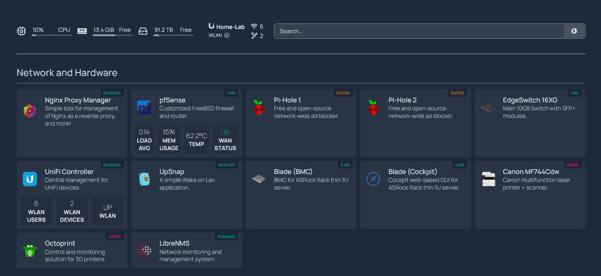

Custom CSS and UI enhancements for Homepage dashboard (gethomepage.dev) -- designed to improve usability and visibility, via slight visual tweaks.

# Homepage Customizations

This repo contains my personal CSS configuration tweak for [Homepage](https://gethomepage.dev) — a modern, lightweight dashboard for self-hosted services.

Over the years, my dashboard has evolved alongside my infrastructure and skills. These customizations reflect both form and function: minimal design choices, improved visual hierarchy, and better usability for monitoring a growing homelab.

---

## Features

- **Custom CSS styling** to enhance layout legibility via added horizontal rule with subtle animations and hover effects

---

## 📸 Screenshot



> *See the writeup and video tour on my website:*  
> [https://jacques.home-lab.site](https://jacques.home-lab.site/how-i-monitor-my-entire-homelab-with-one-homepage)

---

## 🧰 Usage

1. Clone or download this repo.
2. Copy the contents of `custom.css` into your `homepage` config folder:

   ```bash
   cp custom.css /path/to/homepage/

3. Restart your container and refresh the page to see the changes.
